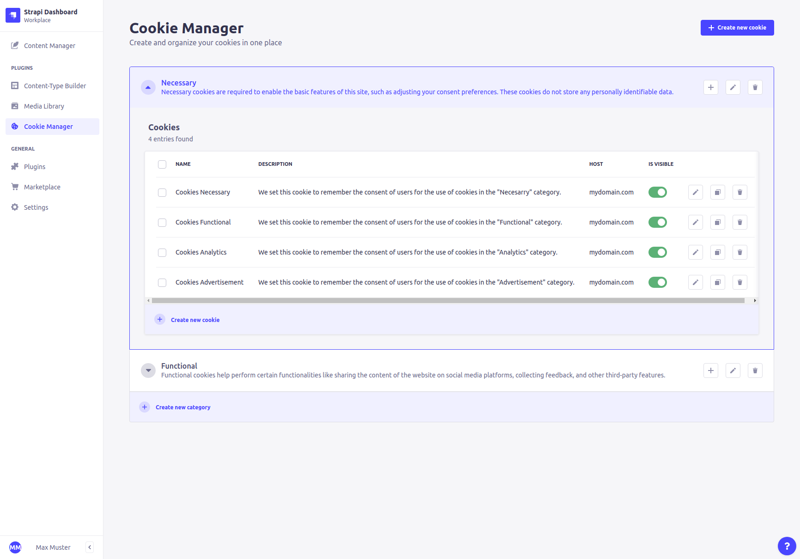
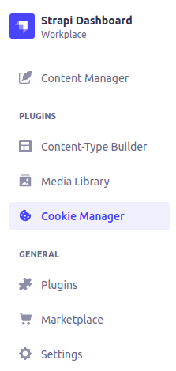
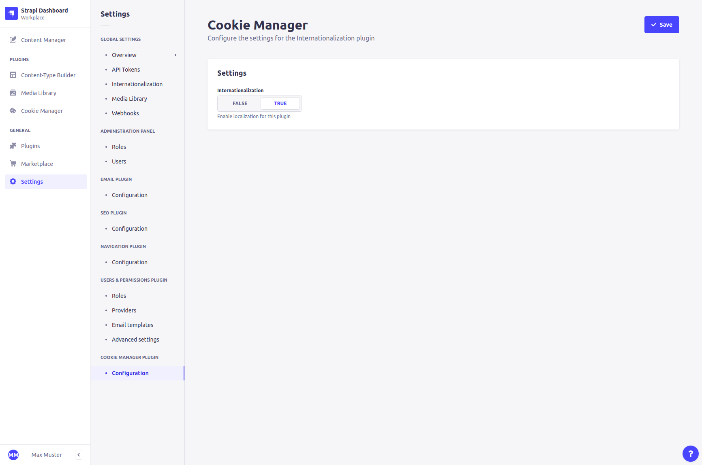

<div align="center" width="150px">
  
</div>

<div align="center">

  # Strapi v4 - Cookie Manager

  <p>
    <a href="https://www.npmjs.org/package/strapi-plugin-cookie-manager">
      
    </a>
    <a href="https://www.npmjs.org/package/strapi-plugin-cookie-manager">
      
    </a>
    <a href="https://github.com/prettier/prettier" target="_blank" rel="noopener noreferrer">
      
    </a>
    <a href="#-contributing">
      
    </a>
    <a href="#-license">
      
    </a>
    <a href="https://twitter.com/intent/follow?screen_name=eigengrau_ch" target="_blank" rel="noopener noreferrer">
      
    </a>
    <a href="#">
      
    </a>
  </p>

  Manage categorized cookies directly within the [Strapi CMS](https://github.com/strapi/strapi) admin panel at one place and use the predefined plugin API to provide GDPR consent cookies.

  

</div>

## 🎉 Features

- **🥞 Predefined API:** Simple and ready for use API endpoint
- **📦 Cookie Categories:** Easly create categories and manage your cookies within
- **💬 Internationalization:** Possibility to localize your cookies supporting Strapi's I18n plugin
- **👥 Duplicate:** Maximize cookie creation efficiency by duplicating
- **🌓 Light & Dark:** Complete reuse of Strapi's design system components
- **📢 GDPR Consent:** Communicate transparently in the name of data privacy
- **📍 One place:** Manage everything related to cookies in one place


## ⚙️ Versions

- Strapi v4 - (current) - [v1.x](https://github.com/eigengrau-ch/strapi-plugin-cookie-manager)


## ⏳ Installation

Install the plugin with your desired package manager.

(It's recommended to use yarn to install this plugin within your Strapi project. [Install yarn with these docs](https://yarnpkg.com/lang/en/docs/install/))

```bash
yarn add strapi-plugin-cookie-manager

# or

npm install strapi-plugin-cookie-manager
```

After successful installation you need to re-build your Strapi:

```bash
yarn build && yarn develop

# or

npm run build && npm run develop
```

or just run Strapis development mode with `--watch-admin` option

```bash
yarn develop --watch-admin

#or

npm run develop --watch-admin
```

Now the Cookie Manager should appear inside the Plugins section on the left hand sidebar like so:




## 🔧 Configuration

Currently there is only one option for the plugin settings.

You can change the plugin settings inside the Strapi admin panel under `Strapi Settings -> Cookie Manager -> Configuration`.



Or you change it manually in your `./config/plugins.js`

```bash
module.exports = ({ env }) => ({
  // ...
  'cookie-manager': {
    enabled: true,
    config: {
      localization: true
    }
  },
  // ...
});
```

### Options

| Option           | Type             | Default |
| ---------------- | ---------------- | ------- |
| localization     | Boolean          | true    |


## 👉 Good to know

Internationalization is enabled per default, even if `disabled`! Disabling it just hides the possibility to edit multiple locales.


## 🤝 Contributing

If you like to enhance, fix or just helping improving the quality or security of the code. Feel free to fork and make a pull request to bring this plugin further ahead. All inputs are welcome!


## ❤️ Support the plugin

If this plugin was helpful, dont hesitate giving this plugin a ⭐️.


## 🔗 Links
- [NPM Package](https://www.npmjs.com/package/strapi-plugin-cookie-manager)
- [Github Repository](https://github.com/eigengrau-ch/strapi-plugin-cookie-manager)


## 📝 Licence

[MIT Licence](https://github.com/eigengrau-ch/strapi-plugin-cookie-manager/blob/main/LICENSE) copyright (c) 2022 [eigengrau GmbH](https://eigengrau.ch) & [Strapi Inc](https://strapi.io/)